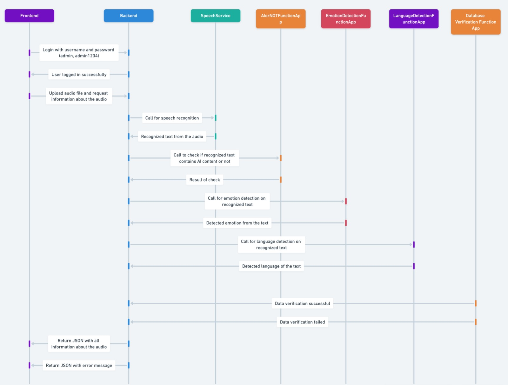
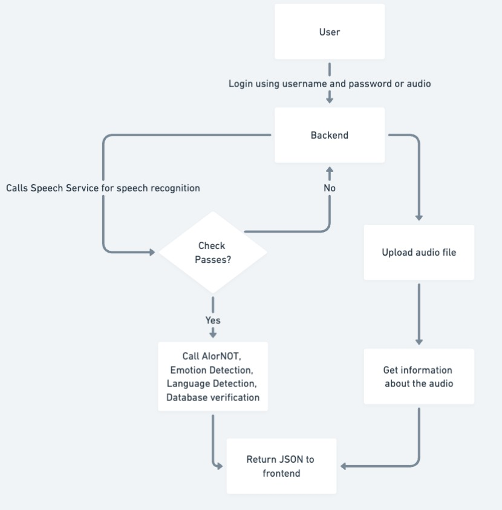

# IdentAI - Identity Impersonation Detection Web Application

## Overview
IdentAI is a platform that allows users to upload audio files for analysis. The application utilizes machine learning models hosted on Azure to perform various analyses on the uploaded audio files, including speech recognition, language detection, emotion detection, and database verification. The application is split into frontend and backend components, both hosted on separate Azure App Services.

## Sequence Diagram


## Flow diagram

*Insert high-level diagram here*

The system consists of the following components:
- **Frontend**: The user interface hosted on Azure App Service. It allows users to log in, upload audio files, and view analysis results.
- **Backend**: The backend server hosted on Azure App Service. It handles user authentication, file uploads, and communication with Azure Speech Service and other Azure App Services for analysis.
- **Machine Learning Models**: Hosted on Azure App Services, these models perform AI detection, language detection, emotion detection, and verify against existing audio file in database.
- **Database**: Currently our database is a directory ( ```./code/Backend/data```). Once the user uploads the file on the web app, it gets saved here and picked up by the models.

## User Flow


1. **User Authentication**:
    - Users can log in using their username and password.
    - Default credentials: Username - admin, Password - admin1234.
2. **File Upload**:
    - After logging in, users can upload an audio file for analysis.
3. **Analysis**:
    - Upon file upload, the backend communicates with Azure Speech Service to perform speech recognition.
    - After successful speech recognition, the backend calls the machine learning models hosted on Azure App Services to perform AI detection, language detection, emotion detection, and database verification.
4. **Analysis Results**:
    - The results of the analysis are displayed to the user on the frontend. The format of the JSON is currently as follows:

    ```
    # response payload structure
    response = {
        "status": "",
        "analysis": 
            {
                "detectedVoice": "",
                "voiceType": 
                    {
                        "type": "",
                        "probability": 
                            {
                                "human": "",
                                "ai": ""
                            }
                    },
                "additionalInfo": 
                    {
                        "emotionalTone": 
                            {
                                "tone": "",
                                "confidence": ""
                            },
                        "language": "",
                        "matching_data":""
                    }
            }
    }
    ```
    - Analysis results include information such as whether the voice is AI-generated, detected language, detected emotion, and whether the voice exists in the database.

## Deployment Instructions
To deploy the Identity Impersonation Detection Web Application, follow these steps:

1. **Frontend Deployment**:
    - Deploy the frontend code to an Azure App Service.
2. **Backend Deployment**:
    - Deploy the backend code to another Azure App Service.
3. **Azure Speech Service**:
    - Set up an Azure Speech Service instance and configure the backend to communicate with it.
4. **Machine Learning Models**:
    - Host the machine learning models on Azure App Services.
5. **Database**:
    - Set up a database to store user information and audio file metadata.

## Databases 

The check if there is a voice or not, 
Multiple datasets were used to train the respective models for each use case:

1. AI detection - 
    - Fake Voices - Fake Voice Dataset: WaveFake (v1.20)
    - Real Voices - Human Voice Dataset: LJ Speech (v1.1)
2. Language Detection - Pretrained Model OpenSource Library
3. Emotion Detection - Pretrained Model Hugging Face Library
4. Verify against Existing Data - Mozilla Common Voice dataset 